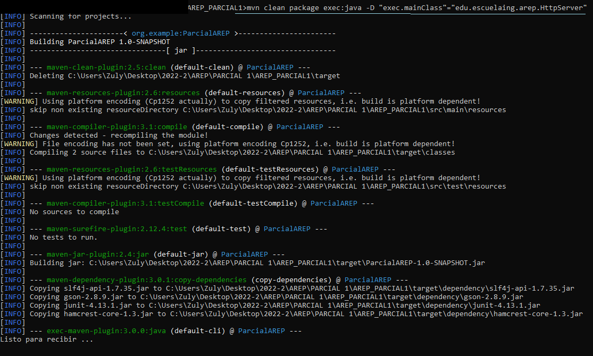
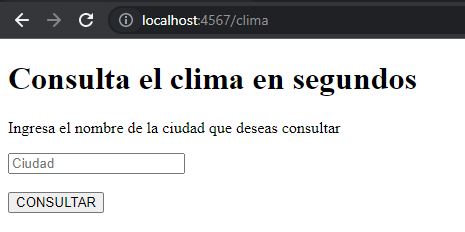
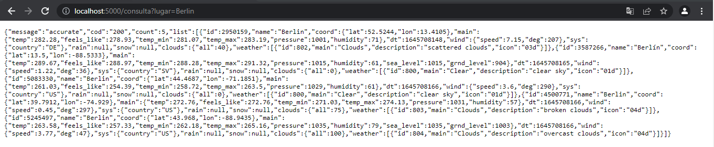
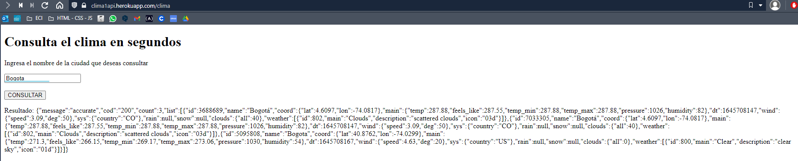
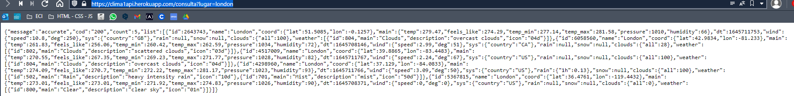

APLICACIÓN WEB PARA EL CLIMA

El propósito de este proyecto consiste en construir una aplicación web simple la cual permite consultar el estado del clima en lugares especificos de la tierra.

## Cómo empezar

A continuación podrá encontrar los pasos ccon los cuales puede acceder a la aplicación de manera remota o usar el proyecto de manera local.

### Prerrequisitos

* [Maven](https://maven.apache.org/) - Administrador de dependencias
* [Java ](https://www.oracle.com/co/java/technologies/javase/javase-jdk8-downloads.html)  Lenguaje de desarrollo
* [Git](https://git-scm.com/) - Sistema de control de versiones

***Nota:** Para visualizar mejor las imagenes de ejemplo y explicación puede hacer click sobre ellas.*

### Instalación

Para descargar el proyecto ejecute 

    git clone https://github.com/ZulyVargas/AREP_PARCIAL1.git

Para ejecutar desde la ubicación del proyecto 

    mvn clean package exec:java -D "exec.mainClass"="edu.escuelaing.arep.HttpServer"

En su navegador ingrese a la siguiente dirección para visualizar la página de inicio:

    http://localhost:4567/clima

Para hacer uso de la consulta del clima sin interfaz ingresar:

    http://localhost:5000/consulta?lugar={ciudad}

Ejemplo de uso y respuesta:

## Despliegue

Para emplear la API de manera remota, ingrese a su navegador de preferencia mediante el botón mostrado anteriormente.
Aquí podrá consultar el clima de la ciudad que desea:

Para usar la API remota ingrese:

    https://clima1api.herokuapp.com/consulta?lugar={ciudad}
    

## Documentación
Para generar la documentación se debe ejecutar:

    mvn javadoc:javadoc

Para visualizar diríjase a la siguiente dirección: 
* [Documentación](https://github.com/ZulyVargas/AREP_PARCIAL1/tree/master/javadoc)

## Construido con 

* [Maven](https://maven.apache.org/) - Administrador de dependencias
* [Heroku](https://heroku.com) - Plataforma de despliegue

## Autores

**Zuly Valentina Vargas Ramírez** 

## Licencia

Este proyecto esta bajo la licencia GNU(General Public License) los detalles se encuentran en el archivo [LICENSE](LICENSE.txt).
